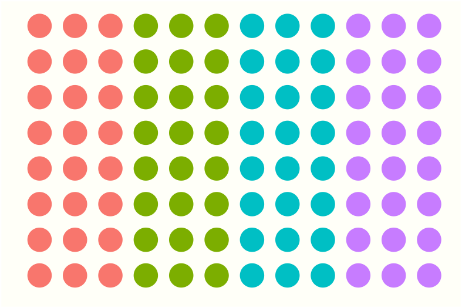

<!-- README.md is generated from README.Rmd. Please edit that file -->

<style type="text/css">
span > img {
 float:left;
}
</style>


# gplate <a href="https://kaiaragaki.github.io/gp/"></a>

<!-- badges: start -->
<!-- badges: end -->

**gplate** introduces a **g**rammar of **plate**s. 

Microwell plates are usually arranged in visually meaningful ways but are not tidy data, and their manipulation to and from a tidy form is cumbersome. gplate is aimed at both developers that create packages that ingest and produce plate data as well as for interactive operating on microwell data.

## Installation

You can install the development version from [GitHub](https://github.com/) with:

``` r
# install.packages("devtools")
devtools::install_github("KaiAragaki/gplate")
```
## Creating plates with gplate

Creating a plate plot is simple:


```r
library(gplate)
#> Error in library(gplate): there is no package called 'gplate'
gp(rows = 16, cols = 24) |>
  gp_plot(as.factor(.row))
#> Error in gp_plot(gp(rows = 16, cols = 24), as.factor(.row)): could not find function "gp_plot"
```
We can add rectangular 'sections' to our plates:


```r
gp(rows = 16, cols = 24) |> 
  gp_sec("my_section", nrow = 12, ncol = 6) |> 
  gp_plot(my_section)
#> Error in gp_plot(gp_sec(gp(rows = 16, cols = 24), "my_section", nrow = 12, : could not find function "gp_plot"
```

These sections can have sections of their own, just by layering one `gp_sec` on the other.


```r
gp(rows = 16, cols = 24) |> 
  gp_sec("my_section", nrow = 12, ncol = 6) |> 
  gp_sec("secsec", nrow = 3, ncol = 3) |> 
  gp_plot(secsec)
#> Error in gp_plot(gp_sec(gp_sec(gp(rows = 16, cols = 24), "my_section", : could not find function "gp_plot"
```

`gp` also has a theme - `gp_mini_theme` - that lets you create sparkline-esque plates.


```r
mini_plot_cols <- gp(8, 12) |> 
  gp_sec(name = "primers", ncol = 3) |> 
  gp_plot(primers) + 
  gp_mini_theme()
#> Error in gp_plot(gp_sec(gp(8, 12), name = "primers", ncol = 3), primers): could not find function "gp_plot"
ggplot2::ggsave(filename = "./man/figures/mini-plot_cols.png", 
                plot = mini_plot_cols,
                height = 0.5, 
                width = 0.75, 
                units = "in", 
                scale = 3.5)
#> Error in plot_theme(plot): object 'mini_plot_cols' not found

mini_plot_rows <- gp(8, 12) |> 
  gp_sec(name = "primers", nrow = 3) |> 
  gp_plot(primers) + 
  gp_mini_theme()
#> Error in gp_plot(gp_sec(gp(8, 12), name = "primers", nrow = 3), primers): could not find function "gp_plot"
ggplot2::ggsave(filename = "./man/figures/mini-plot_rows.png", 
                plot = mini_plot_rows,
                height = 0.5, 
                width = 0.75, 
                units = "in", 
                scale = 3.5)
#> Error in plot_theme(plot): object 'mini_plot_rows' not found
```

For instance:

> You should align your primers in columns <span>{width=75px}</span> instead of in rows <span>{width=75px}</span>
