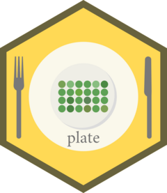

<!-- README.md is generated from README.Rmd. Please edit that file -->

# Plate 

<!-- badges: start -->
<!-- badges: end -->

**gp** is a package meant to provide introduce a **g**rammar of
**p**lates. Microwell plates are usually arranged in visually meaningful
ways but are not tidy data, and their manipulation into a tidy form (or
back) is uniquely cumbersome. This package is aimed at both developers
that create packages that ingest and produce plate data as well as for
interactive use.

## Installation

You can install the development version from
[GitHub](https://github.com/) with:

``` r
# install.packages("devtools")
devtools::install_github("KaiAragaki/gp")
```

## Example

This is a basic example which shows you how to solve a common problem:

``` r
library(Plate)
## basic example code
```

What is special about using `README.Rmd` instead of just `README.md`?
You can include R chunks like so:

``` r
summary(cars)
#>      speed           dist       
#>  Min.   : 4.0   Min.   :  2.00  
#>  1st Qu.:12.0   1st Qu.: 26.00  
#>  Median :15.0   Median : 36.00  
#>  Mean   :15.4   Mean   : 42.98  
#>  3rd Qu.:19.0   3rd Qu.: 56.00  
#>  Max.   :25.0   Max.   :120.00
```

You’ll still need to render `README.Rmd` regularly, to keep `README.md`
up-to-date. `devtools::build_readme()` is handy for this. You could also
use GitHub Actions to re-render `README.Rmd` every time you push. An
example workflow can be found here:
<https://github.com/r-lib/actions/tree/master/examples>.

You can also embed plots, for example:


In that case, don’t forget to commit and push the resulting figure
files, so they display on GitHub and CRAN.

# Vocabulary

## Axes

There are only two axes when defining plates: rows and columns

-   `row`: The absolute row of the plate, starting at the **top** of the
    plate. This axis corresponds most closely with the physical plate.
-   `col`: The absolute column of the plate, starting at the **left** of
    the plate. This axis corresponds most closely with the physical
    plate.

### Modifiers

These axes can have modifier(s) appended to their name, like:

-   `sec`: section. This is the axis number of a given
    [section](#sections).
-   `rel`: relative. This flips the axes such that the starting corner
    is now (1, 1)

These modifiers are not mutually exclusive or necessary - `row_sec`,
`col_sec_rel`, and `row` are all possible columns. However, order is
important: `sec` will always come before `row` if present.
KAINOTE(columns where?)

## Sections

A section is a rectangular field of wells. A plate is section - the
largest section. Sections can have sections of their own - these are
child sections. All sections except the plate have parent sections.
Sections must be - at most - the same size as their parent section. **As
of writing, sections must all be the same size, but this will likely
change**. **Wrapping is not yet implemented**.
